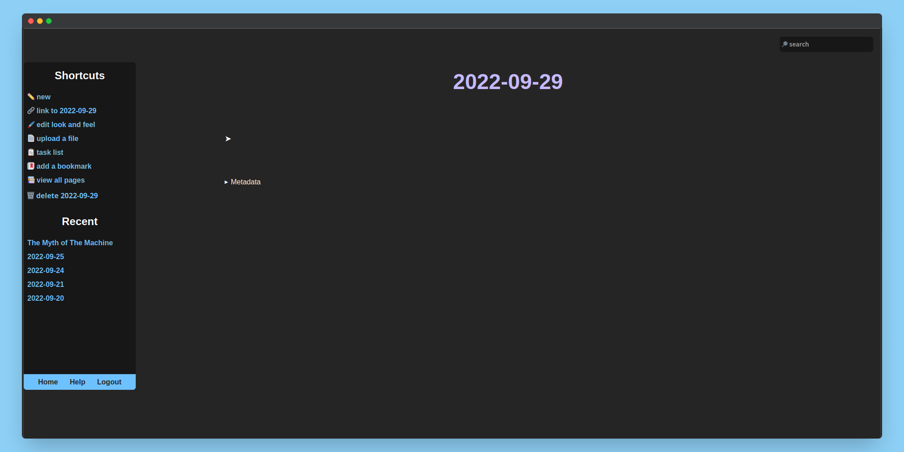
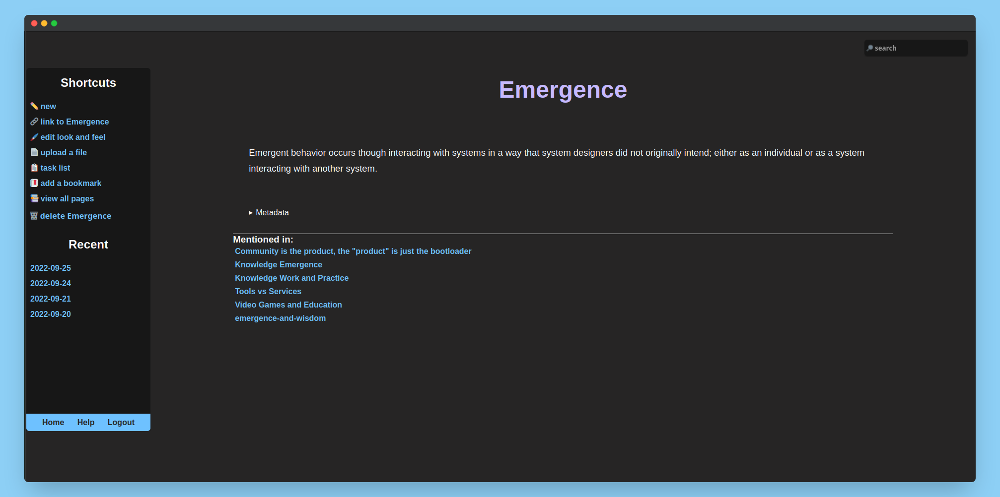

# Tendril Wiki

[](https://github.com/jamestthompson3/platform/actions/workflows/rust.yml)



### Nice features

- Works without JavaScript
- Self hosted, files can be composed easily with other tools since they are plaintext
- Both light and dark themes




## Installation

### From source

This requires you to have the Rust toolchain installed. You can install this by cloning the repo, and running `cargo install --path .` from inside the `bin` directory. Then run `tendril -i` to bring up the interactive bootstrapper.

### From latest release

Download the latest binary for your OS from the releases page. After unzipping the folder, run `./tendril -i` to bootstrap your wiki. You will then want to add this to your path with `sudo mv ./tendril /usr/local/bin` or annotating you `.bashrc` to point to the location where you've unzipped the release folder.

## Getting started

Before starting, you'll need to run `tendril -i` to bootstrap your wiki. An important note here is that when asked for a password, you are not encrypting the notebook, but rather it acts as a password for the webserver. Unauthorized requests will be rejected, but the notebook itself will still be stored in plaintext files on disk.

### Running the wiki

After bootstrapping the wiki, you can run `tendril` to start the webserver.

### Building a static site

You can also build a static site by runing `tendril -b`.

### Updating your installation

You can make sure that you copy over any new template or config files after each update by running `tendril -u` after downloading the latest release or building from source.

### Interstitial Journaling

You can use Tendril Wiki for interstitial journaling both through the command line or through the web interface! From
the command line, you can call `tendril`, followed by the line you want to add to the daily log:

```bash
tendril "I'm working on adding features I want for my workflow in Tendril Wiki"
```

This will append the line to the daily log entry, or create the entry if it does not exist. It's important to note that
you will need to properly escape quotes from you shell if you choose to update the daily log via the CLI. After
processing the entry, Tendril Wiki will also automatically update the git repo if you've chosen to use the git sync
feature in your config file.

### Customization

You can find your configuration and your custom CSS files in the config directory. The location of this directory depends on your platform and will be printed out when you run `tendril --version`.

You can also set a per-note favicon by uploading the image you wish to use as a favicon and then adding the "icon" field to the notes metadata:

```md
---
title: magic and computers
icon: potion.svg
tags: [emergence, technology]
---
```

This will look for the `potion.svg` file uploaded by you and set it as the favicon for the `magic and computers` note.
